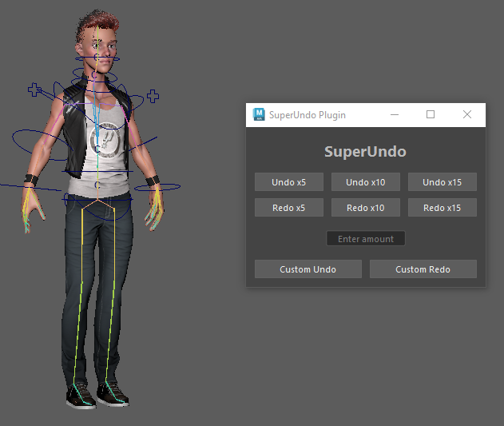
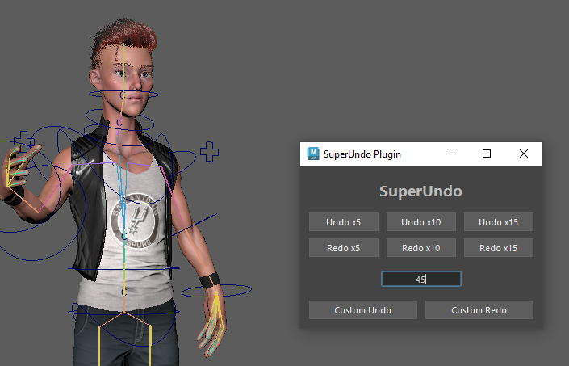

# SuperUndo Plugin

## This plugin allows the user to undo or redo multiple times with the click of a button.

* 3 presets for undo and redo
* custom buttons for larger or specific amounts of undos/redos

After running commandPort -name "'localhost:7001'" and AddPathToMaya.py
run the SuperUndo.py script to open the SuperUndo window.

(SuperUndo window open in maya)

Click one of the buttons to undo or redo a preset amount of times or
input a number from 1 to 999 and press the desired custom action button to undo or redo the specified amount of times.